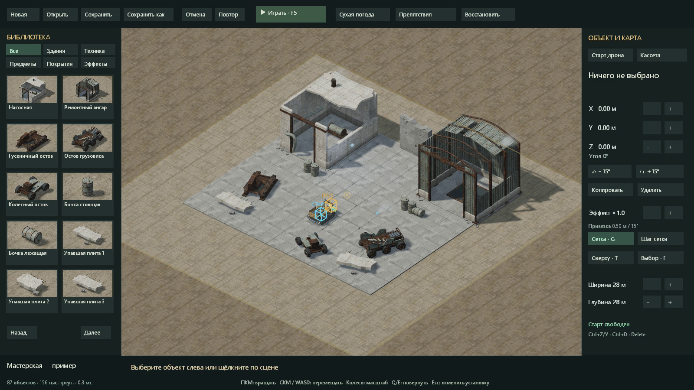
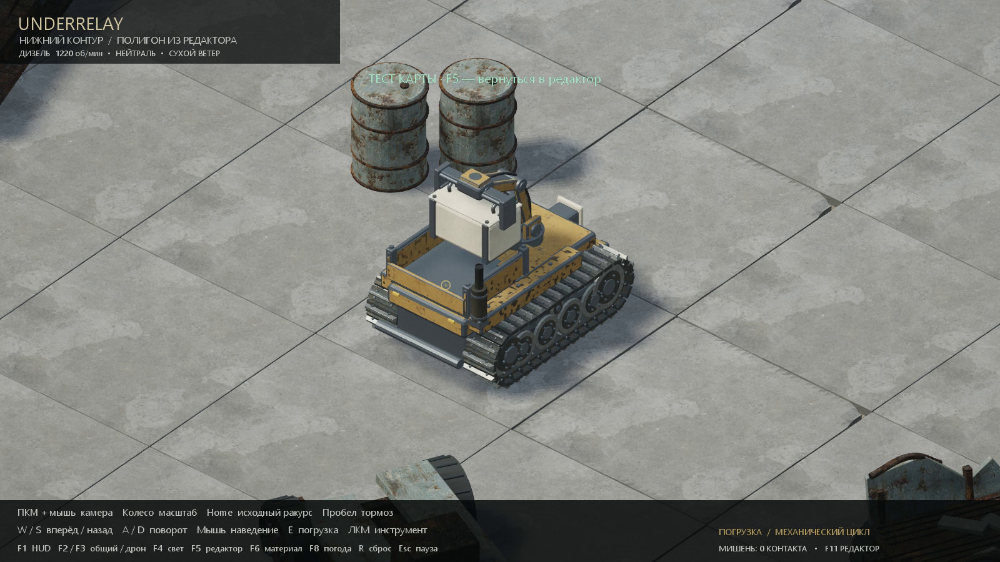
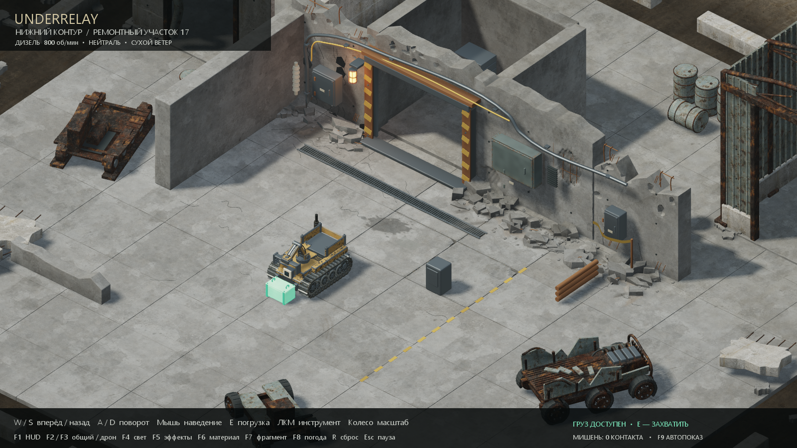

# Underrelay / Нижний контур — V0.2.0

Изометрическое демо для **Windows 10/11 x64 / Direct3D 12**: дизельный гусеничный дрон, механический захват и заброшенный ремонтный двор.

**[Скачать демо для Windows — EXE и ресурсы в ZIP](https://github.com/mospromsoft-dotcom/Underrelay-Demo/releases/download/v0.2.0/Underrelay-0.2.0-win64.zip)** · [Страница выпуска](https://github.com/mospromsoft-dotcom/Underrelay-Demo/releases/tag/v0.2.0) · [Изменения](CHANGELOG.md)

## Запуск

1. Скачайте архив по ссылке выше. Вход в GitHub не требуется.
2. Распакуйте **всю папку** из архива.
3. Для редактора запустите **Editor.cmd** (или F11 в игре). F5 — тест карты и возврат.
4. Для прежнего двора запустите `Underrelay.exe` или `Play.cmd`. `Watch.cmd` показывает погрузку, проезд и въезд в ангар.

SDL3.dll, папки assets и shaders должны оставаться рядом с EXE. Интернет и установка дополнительных инструментов для игры не нужны. Автоматические архивы GitHub «Source code» содержат страницу демо; готовая игра находится в `Underrelay-0.2.0-win64.zip`.

Новое в V0.2.0: простой редактор площадок. 21 элемент с миниатюрами: здания, остовы, бочки, плиты, покрытия, свет, пар, дым и искры. Расстановка, перенос, поворот и высота, сетка, копирование, отмена/повтор, сохранения и тест дроном.

## Как собрать карту

Выберите объект слева и поставьте ЛКМ; Esc завершает расстановку. ЛКМ выбирает и перетаскивает, Q/E поворачивают, PgUp/PgDn меняют высоту. Ctrl+D — копия, Delete — удалить, Ctrl+Z/Y — отмена/повтор. ПКМ вращает, WASD/средняя кнопка перемещают камеру, колесо меняет масштаб, T — сверху, F — выбранный объект.

Ctrl+S — сохранить, Ctrl+Shift+S — сохранить как, Ctrl+O — открыть, Ctrl+N — новая карта. По умолчанию карты находятся в **%LOCALAPPDATA%\Underrelay\Maps**. Предыдущий файл остаётся в .bak; отдельное автосохранение каждые 30 секунд восстанавливается кнопкой «Восстановить». Пакетный пример защищён от перезаписи через редактор.

F5 запускает копию карты. В примере нажмите E, чтобы проверить погрузку. Повторное F5 возвращает исходную расстановку и камеру. Сохраняется карта, а не прогресс теста. Старт и кассета передвигаются отдельными маркерами.

Плоская карта 16–64 м, максимум 512 объектов, 2 млн треугольников экземпляров и 8 источников света; это ограничения формата, а не обещание частоты кадров. Размер моделей фиксирован. Рельефа, этажей, группового выбора и редактора миссий пока нет.

## Что есть в этом показе

- Дизельный дрон с объёмной гусеничной ходовой, непрерывным холостым ходом, дымом под нагрузкой и задержкой/звуком реверса.
- Анимационная погрузка кассеты с широким допуском и подсветкой готового к захвату груза.
- Бетонная насосная, ремонтный ангар, три остова, бочки и упавшие плиты.
- Пар, искры, пыль и переключаемый дождь.

С V0.1.0 удалены неестественный синтетический стук двигателя и дальняя картинка с неподходящей перспективой. Записанный двигатель работает также на стоянке и нейтрали.

## Управление

| Действие | Клавиши |
|---|---|
| Передний / задний ход по корпусу | W / S |
| Повернуть нос влево / вправо | A / D |
| Навести инструмент | Мышь |
| Погрузить доступную кассету | E |
| Контактный инструмент | ЛКМ |
| Вращать камеру / наклонять | Удерживать ПКМ + двигать мышь |
| Исходный угол камеры | Home |
| Остановка | Пробел |
| Масштаб | Колесо мыши |
| Обзор двора / крупная машина | F2 / F3 |
| Дождь / сухая погода | F8 |
| Открыть редактор / тест и возврат | F11 / F5 в редакторе |
| Сброс и автопоказ | F9 |
| Сброс / пауза / выход | R / Esc / F10 |
| Интерфейс / другой свет / эффекты / нейтральный материал | F1 / F4 / F5 / F6 |

В исходном положении можно сразу нажать E. Зелёная кассета означает, что захват доступен; наведение мышью точно на неё не требуется.

## Границы демо

Это визуальная и механическая проба. Новые остовы и бочки — препятствия; разбирать или грузить их пока нельзя. Одно место для кассеты, без разгрузки. Нет законченной экспедиции, противников, сети, экономики и сохранений игрового прогресса. Исходный код развивается в отдельном закрытом репозитории.

SHA-256 архива опубликован рядом с выпуском. `BUILD_INFO.json` внутри пакета содержит версию, ревизию исходников и хеши файлов. Компоненты и внешние ресурсы перечислены в [THIRD_PARTY.md](THIRD_PARTY.md); лицензии включены в архив.
